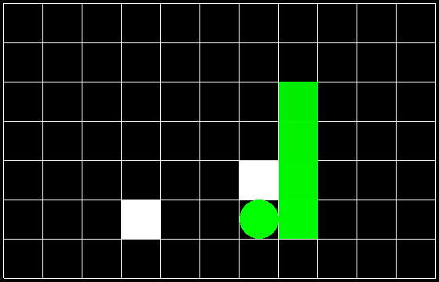

# Snake

This example presents a variant of the classic arcade Snake game, where players navigate a continuously growing snake to consume food on an 11 x 7 board. Uniquely, this version features always two pieces of food on the board and eliminates "walls" at the borders. Instead, when the snake's head crosses the boundary, it reappears on the opposite side.



## Requirements

1. **Installation of libtorch:**
    Follow the instructions on the official PyTorch website: https://pytorch.org/cppdocs/installing.html. In this example, we select the GPU version of libtorch. Please modify the paths in the following part of CMakeList (examples/lunar_lander/CMakeList.txt):

    ```
    # libtorch gpu
    set(CUDA_TOOLKIT_ROOT_DIR "path/to/cuda")
    find_package(CUDA REQUIRED)
    list(APPEND CMAKE_PREFIX_PATH "path/to/libtorch")
    find_package(Torch REQUIRED)
    set(CMAKE_CXX_FLAGS "${CMAKE_CXX_FLAGS} ${TORCH_CXX_FLAGS}")
    target_link_libraries(lunar_lander PRIVATE "${TORCH_LIBRARIES}")
    set_property(TARGET lunar_lander PROPERTY CXX_STANDARD 17)
    if (MSVC)
    file(GLOB TORCH_DLLS "${TORCH_INSTALL_PREFIX}/lib/*.dll")
    add_custom_command(TARGET example-app
                        POST_BUILD
                        COMMAND ${CMAKE_COMMAND} -E copy_if_different
                        ${TORCH_DLLS}
                        $<TARGET_FILE_DIR:example-app>)
    endif (MSVC)
    ```

2. **Installation of :**
    SFML provides a simple interface for games and multimedia application.
    ```
    sudo apt-get install libsfml-dev
    ```


## Run

1. **Compile**

    ```
    cd path/to/project
    mkdir build
    cd build
    cmake .. -DBUILD_SNAKE=ON
    make
    ```
2. **Run**
   
    Train and evaluate DQN.
    ```
    ./examples/snake/snake dqn
    ```

    Train and evaluate PPO.
    ```
    ./examples/snake/snake ppo
    ```

    Run MCTS in human mode.
    ```
    ./examples/snake/snake mcts
    ```
    

